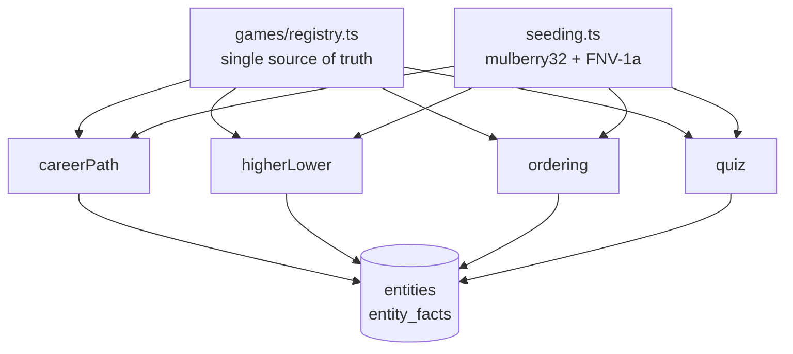
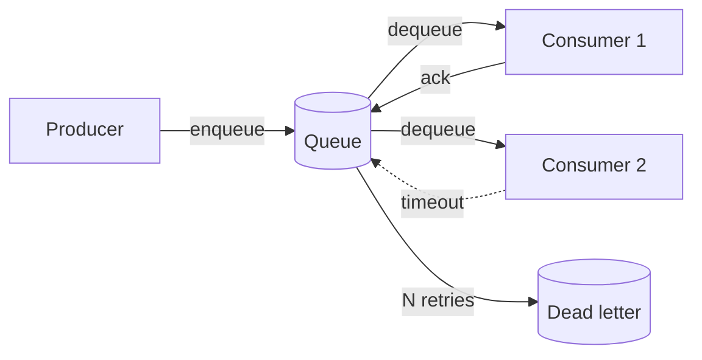
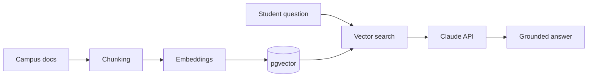

 

  

---

### 👇 Everything below is expandable — click to explore

---

<h2>🚀 &nbsp;Projects &nbsp;<i>(click any to expand)</i></h2>

 

<b>🎮 &nbsp;FULLTIME</b> — multi-sport puzzle platform &nbsp;<code>LIVE</code>

 

> **Seven live sports games. Four shared engines. One daily puzzle for everyone.**

**The interesting problem:** seven sports, but only four *kinds* of game. Building seven separate implementations would have meant seven codebases to maintain. Instead every sport plugs into a shared engine.

| Sport | Game | Engine |
|:--|:--|:--|
| ⚽ Football | Career Path | `careerPath` |
| 🏀 Basketball | Career Path: NBA | `careerPath` |
| 🏏 Cricket | Stat Attack | `higherLower` |
| 🎾 Tennis | Grand Slam Duel | `higherLower` |
| ⚾ Baseball | Diamond Legacy | `higherLower` |
| 🏎️ F1 | Podium Order | `ordering` |
| 🏉 Rugby | Nations Quiz | `quiz` |

<i>→ How the architecture works</i>

 

**Sport-agnostic schema.** Rather than seven sets of tables, everything lives in `entities` (any player, team, driver) and `entity_facts` (any fact about them), with per-sport variation held in a `jsonb` meta column.

**Deterministic daily puzzles.** A seeded PRNG (mulberry32 + FNV-1a) keyed to the UTC date means every player worldwide gets the identical puzzle — with no coordination between clients and no server round-trip to decide what today's puzzle is.

**Anonymous-first.** Stats, streaks, and XP live in localStorage and sync to Supabase only if you choose to sign in. No account required to play or to hit the leaderboard.

<code>Next.js 14</code> <code>TypeScript</code> <code>PostgreSQL</code> <code>Supabase</code> <code>Vercel</code>

 

<b>⚙️ &nbsp;Relay</b> — distributed job queue &nbsp;<code>IN PROGRESS</code>

 

> **A job queue modeled on Amazon SQS, written in Java 21.**

Built to understand what actually happens inside a message queue — delivery guarantees, timeout handling, and what it takes for multiple consumers to poll the same table without stepping on each other.

<i>→ Design goals</i>

 

- **At-least-once delivery** — a message is never silently lost
- **Visibility timeouts** — an in-flight message is hidden from other consumers, and reappears if the worker dies
- **Dead-letter routing** — after a configurable retry limit, poison messages get quarantined instead of looping forever
- **Multi-module Gradle build** — queue engine, API layer, and client library kept separate

<code>Java 21</code> <code>PostgreSQL</code> <code>Gradle</code>

 

<b>🎓 &nbsp;UniHelp</b> — AI campus assistant &nbsp;<code>IN PROGRESS</code>

 

> **Answers student questions from real institutional documents — not from model recall.**

A retrieval-augmented assistant built with my brother. Every answer is grounded in a source document, which is the whole point: a campus assistant that confidently invents a tuition deadline is worse than no assistant at all.

<i>→ The RAG pipeline</i>

 

**What I own:** the retrieval pipeline end to end — chunking strategy, embedding generation, and vector similarity search over pgvector — plus the FastAPI backend and the API contract between us.

<code>React Native</code> <code>Next.js</code> <code>FastAPI</code> <code>Supabase</code> <code>pgvector</code> <code>Claude API</code>

 

<b>🔐 &nbsp;Insider Threat Detection</b> — anomaly detection &nbsp;<code>COMPLETE</code>

 

> **Catches threats it has never seen before.**

An autoencoder and a variational autoencoder trained *only* on normal user activity. Anything the model reconstructs badly is, by definition, unlike normal behaviour — which means it flags novel attack patterns that a supervised classifier trained on known threats would miss entirely.

<i>→ Why unsupervised</i>

 

Labelled insider-threat data barely exists, and the threats that matter most are the ones nobody has catalogued yet. Training on normal behaviour sidesteps both problems: you only need to define *normal*, and everything else falls out as deviation measured by reconstruction error.

<code>Python</code> <code>PyTorch</code> <code>Pandas</code> <code>NumPy</code>

 

<b>📦 &nbsp;Earlier projects</b>

 

| Project | What it is | Stack |
|:--|:--|:--|
| EventSphere | Full-stack event management platform | React · FastAPI · SQLite |
| CHRONOVAULT | Premium single-page retail experience | React · Tailwind · Framer Motion |
| Hoppy Tales | Android storytelling app | Kotlin · Android SDK |
| FastCabs | Relational database design for ride-hailing | MySQL |
| Hotel Management System | Desktop booking and inventory system | Java |
| FIFA World Cup Simulator | Tournament simulation engine | C++ |

---

<h2>🛠️ &nbsp;Stack</h2>

 

**Languages**

**Frontend**

**Backend & Data**

**ML & Tools**

---

<h2>🎓 &nbsp;Education &amp; background</h2>

 

**Bachelor of Computer Information Systems** — University of the Fraser Valley
Software Development major · AI/ML minor · Expected December 2026
**GPA 3.86 / 4.33** · Dean's List, 4 consecutive terms

**Coursework:** Data Structures & Algorithms · Design & Analysis of Algorithms · Distributed Computing & MapReduce · Operating Systems · Database Systems · Software Development Best Practices · Machine Learning

 

**Currently:** AI Intern at InAmigos Foundation · 3+ years part-time at Costco Wholesale alongside a full course load

**Trilingual** in English, Hindi and Punjabi. Messi fan. Will argue about it.

---

<h2>📊 &nbsp;Stats</h2>

 

  

  

 

<picture>
  <source media="(prefers-color-scheme: dark)" srcset="https://raw.githubusercontent.com/Yuv1008/Yuv1008/output/github-contribution-grid-snake-dark.svg" />
  
</picture>

---

### 💬 Ask me about

`RAG pipelines` · `shipping side projects around a part-time job` · `why seven games only needed four engines`

 

**Open to New Grad Software Engineer roles starting 2027.**

